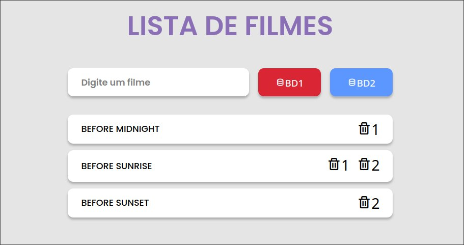
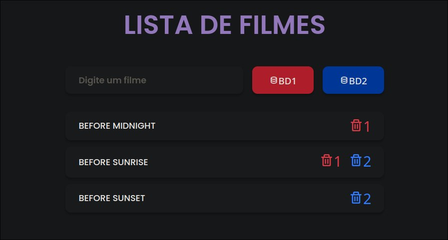

# Lista de Filmes

## Tecnolgias

#### Backend - Rust
* Rocket 🚀 - Web Framework 
* Diesel ⛽ - ORM/Query Builder
* Serde 📄 - Serializing and Deserializing

#### Frontend - Javascript
* ReactJS ⚛️ - Web Framework 
* Axios 🔗 - HTTP Client
* Styled-Components 💅🏾 - Style

#### Database - Relational
* PostgreSQL 🐘 - DBMS

#### Containerization
* Docker & Docker-compose 🐳

## Instalação & Setup

 
```
git clone https://github.com/erlonbie/movie_list.git
```

```
cd movie_list
```

```
docker-compose up --build
```


## Modo de usar

* Uma simples implementção do tipo **Grocery List** para uma lista de filmes.

* Ao apertar em um dos botões, o filme é adicionado no banco de dados correspondente e adicionado à lista de filmes.

* O botão de lixeira com a numeração representa a ação de deletar no respectivo banco de dados. Se o filme estiver em ambos, ele terá os dois ícones e será necessário apagá-lo duas vezes (uma para cada banco).



